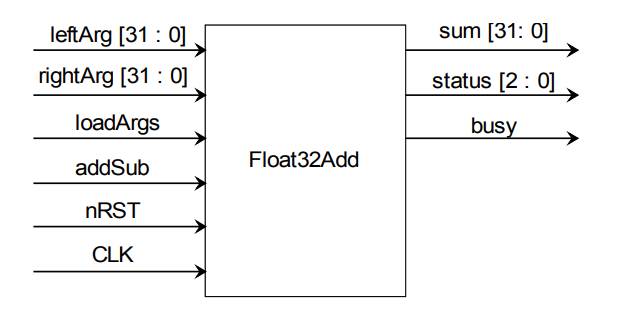
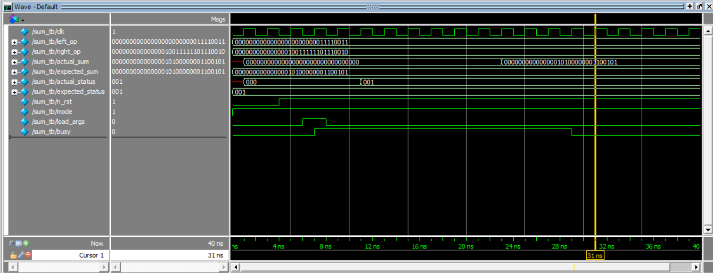
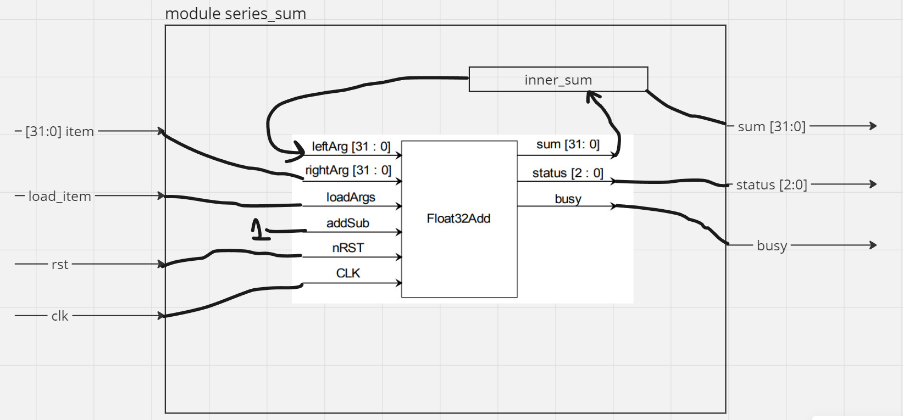

# Сложение двух чисел типа float32
Использование библиотеки `Float32Add.v` продемонстрировано в `sum_tb.sv`.

Сигналы `clk`, `n_rst`, `mode` и `load_args` объявлены типа `bit`, так как в тестбенче не имеет значения наличие у этих сигналов состояний помимо `0` и `1`, но возможно получится выиграть по производительности во время симуляции.

Остальные сигналы специфицированы типом logic, исходя из того, что библиотека реализована на Verilog и возможно дополнительные состояния сигналов могут пригодиться при тестировании. Если использовать модуль из библиотеки в модуле не для тестов, то, полагаю, будет целесообразно везьде использовать тип logic, чтобы во время синтеза автоматически было принято верное решение по реализации схемы.

### Диаграмма модуля библиотеки из документации

### Wave диаграмма симуляции

# Сумма ряда
Реализовать не получилось.
## Мысли
Я бы выполнил модуль таким образом, что модуль вычисления суммы ряда не знает значение числа `N`(количество элементов), так как полагаю оно может быть сколь угодно большим, хоть `10^100`. Это наложит опредёленные ограничения, например в модуль придётся передавать числа по одному и обновлять новое слагаемое по готовности суммы с предыдущим.

Возможно, есть вариант спроектировать параметризованный модуль, который на основе числа N будет неким образом распараллеливать суммирование. Не уверен возможно ли это, но закралась мысль сделать число внутренних модулей типа `Float32Add` зависимым от числа `N` по закону `N-1`, тогда можно будет подать сразу весь ряд на вход, но сложность схемы, а значит и потребление ресурсов будут страшными. Я не очень хорошо разбираюсь в HDL, поэтому не знаю можно ли так проектировать. Можно также ограничиться каким-то определённым числом одновременно суммируемых чисел `M`, тогда внутри модуля будут `M-1` сумматоров и можно каким-нибудь образом оптимизировать `M` в зависимости от требований по производительности.

## Реализация

Пусть бы сложение выполнялось по флагу `load_item`, который сигнализирует о том, что число на входе `item` нужно внести в сумму. Вход `rst` сообщает о потребности сброса значений модуля, который однозначно соотносится с `n_rst` входом модуля из библиотеки. Также вход `clk` служит для предоставления синхросигнала внутрь модуля.

Выходные порты были бы `sum` - сумма, `busy` - 1 если модуль занят вычислениями и 0 если сумма готова, `exception` - то же что и `status` из модуля библиотеки. Устройство модуля заключалось бы в замыкании выхода `sum` модуля `Float32Add` на вход в качестве одного из операндов. Организовать эту связь думал через внутреннюю память своего модуля, но не сориентировался как всё-таки это организовать.
Файлы с набросками - `series_sum.sv`, `series_sum_tb.sv`.
